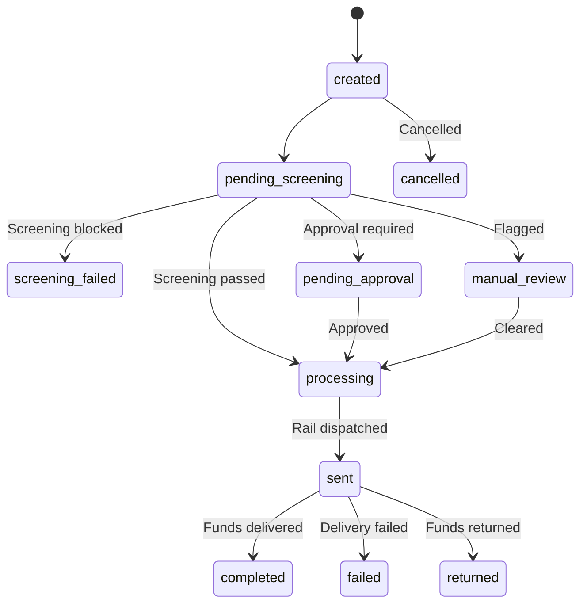

## Overview

A **payout** is the core object in Anton Payments. It represents a single money movement from your merchant account to a beneficiary. When you create a payout, Anton handles compliance screening, rail routing, and delivery automatically.

## Payout lifecycle

Every payout moves through a defined set of statuses. Transitions are enforced by a state machine — no status can be skipped or set directly.



## Statuses

| Status | Description | Terminal? |
|--------|-------------|-----------|
| `created` | Payout accepted, funds reserved from your balance | No |
| `pending_screening` | Undergoing compliance checks (OFAC, PEP, sanctions, velocity rules) | No |
| `screening_failed` | Blocked by compliance — requires manual review by our ops team | No |
| `pending_approval` | High-value or sensitive payout awaiting maker-checker approval | No |
| `processing` | Submitted to the rail provider for delivery | No |
| `sent` | Rail provider confirmed dispatch to the beneficiary's bank/wallet | No |
| `completed` | Funds delivered successfully | **Yes** |
| `failed` | Delivery failed (wrong account, bank rejection, etc.) | **Yes** |
| `returned` | Funds returned after delivery attempt | **Yes** |
| `cancelled` | Payout cancelled before processing | **Yes** |
| `manual_review` | Flagged for human review by risk rules | No |

## Creating a payout

```bash
curl https://api.antonpayments.com/v1/payouts \
  -X POST \
  -H "Authorization: Bearer ak_test_..." \
  -H "Content-Type: application/json" \
  -d '{
    "beneficiary_id": "ben_cng3q8s6ek9kc5qg1h1g",
    "amount": "1000.00",
    "currency": "USD",
    "description": "Contractor payment - January",
    "reference": "PAY-2026-001"
  }'
```

**What happens when you create a payout:**

1. **Validation** — Amount, currency, and beneficiary are validated
2. **Balance check** — Sufficient funds are verified in your account
3. **Funds reserved** — The amount is held from your available balance
4. **Velocity rules checked** — Fraud and compliance rules are evaluated
5. **Screening** — OFAC, PEP, and sanctions checks run automatically
6. **Routing** — The optimal rail provider is selected for the corridor
7. **Delivery** — Funds are dispatched to the beneficiary

## Cancelling a payout

Payouts can only be cancelled before they reach `processing` status:

```bash
curl https://api.antonpayments.com/v1/payouts/pay_abc123/cancel \
  -X POST \
  -H "Authorization: Bearer ak_test_..."
```

Once a payout is `processing`, `sent`, or in any terminal state, it cannot be cancelled. Reserved funds are released back to your balance on cancellation.

## Amounts and currencies

<Warning>
  **Amounts are always strings** — never floating-point numbers. Use exact decimal representation like `"1000.00"`, not `1000` or `1000.0`. This prevents rounding errors with money.
</Warning>

The `currency` field uses ISO 4217 three-letter codes (e.g., `USD`, `GBP`, `EUR`). The payout amount is in the specified currency — Anton handles FX conversion if needed.

## Metadata

You can attach a `reference` field to payouts for your own tracking. This appears in webhook payloads and API responses but does not affect processing.
